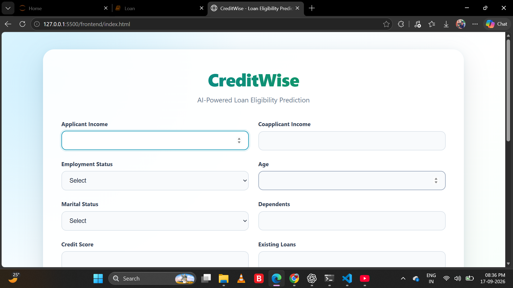
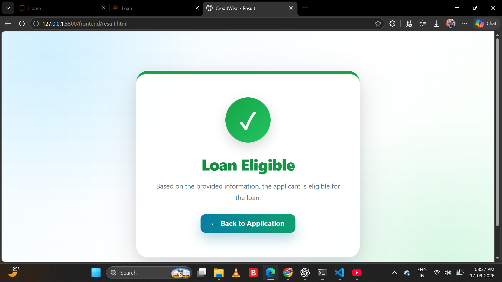
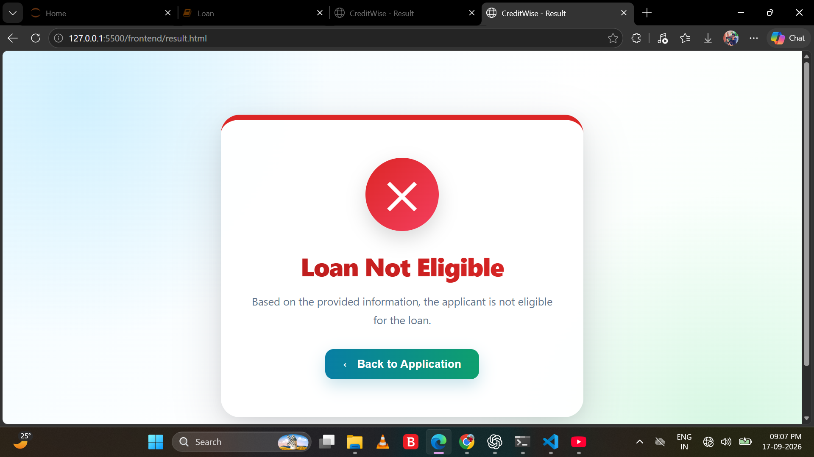
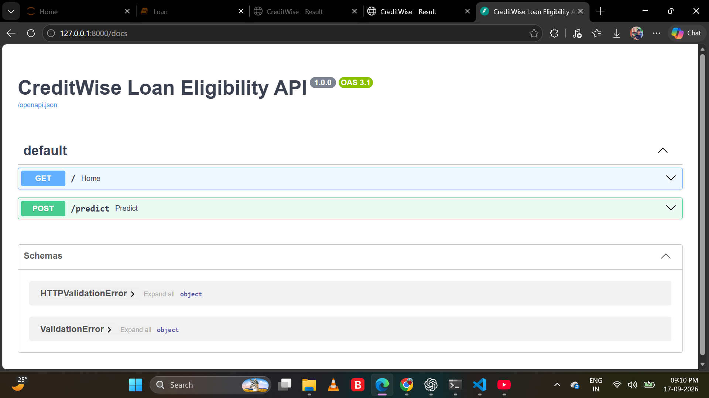

# 💳 CreditWise - Loan Eligibility Prediction

An end-to-end Machine Learning web application that predicts **loan eligibility** based on an applicant's financial, employment, personal, and loan-related information.

The project converts a Machine Learning model developed in Jupyter Notebook into a complete application using **Python, FastAPI, HTML, CSS, and JavaScript**.

---

## 📸 Application Screenshots

### 📝 Loan Application Form



The application provides a user-friendly form where users can enter applicant, financial, employment, and loan information.

---

### ✅ Loan Eligible Result



After submitting the application, the trained Machine Learning model predicts the applicant's loan eligibility and displays the result on a dedicated result page.

---

### ❌ Loan Not Eligible Result



The application displays a separate result when the Machine Learning model predicts that the applicant is not eligible for the loan.

---

### 🔌 FastAPI Documentation



The FastAPI backend provides the `/predict` REST API used by the frontend to communicate with the Machine Learning model.

---

## 🎯 Project Objective

The objective of CreditWise is to develop a Machine Learning-based system that can predict whether a loan application is likely to be approved based on applicant information.

Instead of using only a Jupyter Notebook for prediction, this project integrates the trained model into a complete web application.

### The system provides:

- User-friendly loan application form
- Machine Learning-based prediction
- FastAPI REST API
- Separate prediction result page
- Pre-trained model saved using Joblib
- Frontend and backend integration
- Reusable Machine Learning pipeline

---

## 🚀 Features

- 📊 Exploratory Data Analysis
- 🧹 Data preprocessing
- 🔧 Missing-value handling
- 🔤 Categorical feature encoding
- 📏 Feature scaling
- 🤖 Logistic Regression Machine Learning model
- 💾 Trained model serialization using Joblib
- ⚡ FastAPI backend
- 🌐 HTML/CSS/JavaScript frontend
- 🔗 REST API integration
- 📱 Responsive user interface
- ✅ Loan eligibility result page
- 🔄 Back-to-application functionality

---

## 🧠 Machine Learning

The project uses **Logistic Regression** as the final Machine Learning model.

### Why Logistic Regression?

Loan eligibility is a binary classification problem where the model predicts one of two outcomes:

```text
Yes → Loan Eligible
No  → Loan Not Eligible
```

The Logistic Regression model is integrated into a preprocessing and prediction pipeline.

---

## 📋 Input Features

The model uses the following applicant information:

### Financial Features

- Applicant Income
- Coapplicant Income
- Credit Score
- Existing Loans
- DTI Ratio
- Savings
- Collateral Value
- Loan Amount
- Loan Term

### Personal Features

- Age
- Marital Status
- Dependents
- Gender
- Education Level

### Employment Features

- Employment Status
- Employer Category

### Loan Features

- Loan Purpose
- Property Area

---

## 🔄 Machine Learning Workflow

```text
Dataset
   ↓
Data Cleaning
   ↓
Missing Value Handling
   ↓
Exploratory Data Analysis
   ↓
Categorical Encoding
   ↓
Feature Scaling
   ↓
Train-Test Split
   ↓
Model Training
   ↓
Model Evaluation
   ↓
Final Logistic Regression Pipeline
   ↓
Save Model as loan_model.pkl
   ↓
FastAPI Backend
   ↓
Frontend Application
   ↓
Loan Eligibility Prediction
```

---

## 📊 Model Performance

The final Logistic Regression pipeline achieved the following results on the test data:

| Metric | Score |
|---|---:|
| Accuracy | 88.42% |
| Precision | 85.19% |
| Recall | 76.67% |
| F1 Score | 80.70% |

### Confusion Matrix

```text
[[122   8]
 [ 14  46]]
```

These values represent the evaluation performed on the project's test dataset.

---

## 🏗️ System Architecture

```text
                    ┌──────────────────────┐
                    │       User           │
                    └──────────┬───────────┘
                               │
                               ▼
                    ┌──────────────────────┐
                    │  Frontend            │
                    │  HTML/CSS/JavaScript │
                    └──────────┬───────────┘
                               │
                               │ JSON Request
                               ▼
                    ┌──────────────────────┐
                    │     FastAPI          │
                    │     Backend          │
                    └──────────┬───────────┘
                               │
                               ▼
                    ┌──────────────────────┐
                    │  ML Pipeline         │
                    │  Preprocessing        │
                    │  + LogisticRegression│
                    └──────────┬───────────┘
                               │
                               ▼
                    ┌──────────────────────┐
                    │   loan_model.pkl     │
                    │  Trained ML Model    │
                    └──────────┬───────────┘
                               │
                               ▼
                    ┌──────────────────────┐
                    │ Prediction: Yes / No │
                    └──────────────────────┘
```

---

## 🛠️ Technology Stack

### Machine Learning

- Python
- Pandas
- NumPy
- Scikit-learn
- Joblib
- Jupyter Notebook

### Backend

- FastAPI
- Uvicorn
- Python

### Frontend

- HTML5
- CSS3
- JavaScript

### Development Tools

- VS Code
- Git
- GitHub
- Live Server

---

## 📁 Project Structure

```text
Credit_wise_LOan approval/
│
├── backend/
│   └── main.py
│
├── dataset/
│   └── dataset.csv
│
├── frontend/
│   ├── index.html
│   ├── style.css
│   ├── script.js
│   └── result.html
│
├── model/
│   └── loan_model.pkl
│
├── notebooks/
│   └── loan_eligibility.ipynb
│
├── Screenshots/
│   ├── form.png
│   ├── eligible.png
│   ├── not_eligible.png
│   └── api_docs.png
│
├── .gitignore
├── README.md
└── requirements.txt
```

---

## ⚙️ Installation

### 1. Clone the Repository

```bash
git clone https://github.com/Abhayjadhav01/CreditWise-Loan-Eligibility-Prediction.git
```

### 2. Navigate to the Project

```bash
cd CreditWise-Loan-Eligibility-Prediction
```

### 3. Install Required Packages

```bash
pip install -r requirements.txt
```

---

## ▶️ Running the Backend

From the project root directory, run:

```bash
uvicorn backend.main:app --reload
```

The backend will start at:

```text
http://127.0.0.1:8000
```

---

## 📚 FastAPI Documentation

FastAPI automatically provides interactive API documentation.

Open:

```text
http://127.0.0.1:8000/docs
```

The main prediction endpoint is:

```text
POST /predict
```

---

## 🌐 Running the Frontend

Open the `frontend` folder in VS Code.

Run:

```text
index.html
```

using **Live Server**.

The frontend communicates with the FastAPI backend through:

```text
http://127.0.0.1:8000/predict
```

Make sure the backend is running before submitting the application.

---

## 🔌 API Example

### Endpoint

```text
POST /predict
```

### Sample Request

```json
{
    "Applicant_Income": 50000,
    "Coapplicant_Income": 10000,
    "Employment_Status": "Salaried",
    "Age": 30,
    "Marital_Status": "Married",
    "Dependents": 2,
    "Credit_Score": 750,
    "Existing_Loans": 1,
    "DTI_Ratio": 0.30,
    "Savings": 100000,
    "Collateral_Value": 300000,
    "Loan_Amount": 200000,
    "Loan_Term": 20,
    "Loan_Purpose": "Home",
    "Property_Area": "Urban",
    "Education_Level": "Graduate",
    "Gender": "Male",
    "Employer_Category": "Private"
}
```

### Sample Response

```json
{
    "loan_prediction": "Yes"
}
```

---

## 💾 Model Deployment Approach

The trained Machine Learning pipeline is saved using Joblib:

```python
joblib.dump(final_pipeline, "loan_model.pkl")
```

The FastAPI backend loads the saved model:

```python
model = joblib.load(MODEL_PATH)
```

The model is loaded when the backend starts.

For every new application:

```text
User Input
     ↓
Frontend
     ↓
FastAPI API
     ↓
Saved ML Pipeline
     ↓
Prediction
     ↓
Result Page
```

The model is **not retrained for every new applicant**. The trained model is stored and reused for predictions.

---

## 🔐 Data Processing

The Machine Learning pipeline handles preprocessing before prediction.

### Numerical Features

The numerical pipeline uses:

```text
SimpleImputer
      ↓
StandardScaler
```

### Categorical Features

The categorical pipeline uses:

```text
SimpleImputer
      ↓
OneHotEncoder
```

The preprocessing and Machine Learning model are combined into a single Scikit-learn pipeline.

---

## 📌 Important Notes

- The `.pkl` file contains the trained Machine Learning model.
- Do not open or edit the `.pkl` file manually.
- The backend and frontend must both be running for prediction.
- The model should only be used with input features matching the trained pipeline.
- `loan_model.pkl` is intentionally included because it is required by the backend.

---

## 🔮 Future Enhancements

Possible improvements include:

- 📈 Loan approval probability
- 📊 Prediction confidence
- 👤 User authentication
- 🗄️ Database integration
- 📋 Loan application history
- 📥 Downloadable prediction reports
- 📱 Improved mobile interface
- ☁️ Cloud deployment
- 🔄 Model retraining pipeline
- 📊 Admin dashboard
- 🔐 Secure API authentication

---

## 🎓 Learning Outcomes

Through this project, the following concepts were implemented:

- Machine Learning classification
- Data preprocessing
- Exploratory Data Analysis
- Feature engineering
- Model evaluation
- Scikit-learn pipelines
- Model serialization
- REST API development
- FastAPI
- Frontend-backend integration
- JSON data communication
- Git and GitHub project management

---

## ⚠️ Disclaimer

This project is developed for **educational and demonstration purposes**.

The prediction produced by the system should not be considered a real financial or banking decision. Actual loan approval depends on additional factors, policies, verification procedures, and financial institution requirements.

---

## 👨‍💻 Author

**Abhay Jadhav**

AIML Engineering Student

GitHub:

https://github.com/Abhayjadhav01

---

## ⭐ Project

If you find this project useful for learning Machine Learning and full-stack ML application development, consider giving the repository a ⭐ on GitHub.
